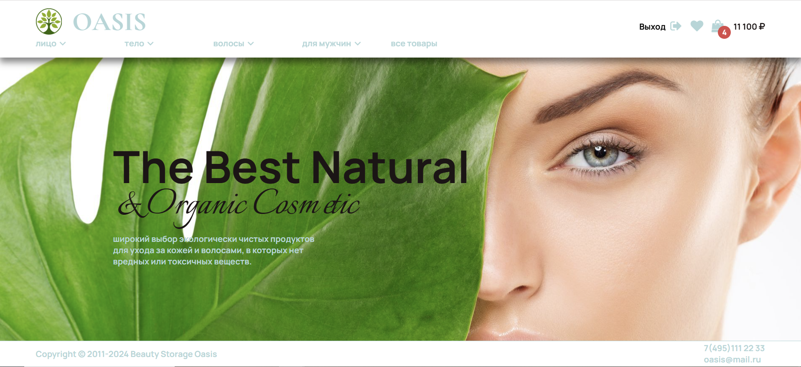
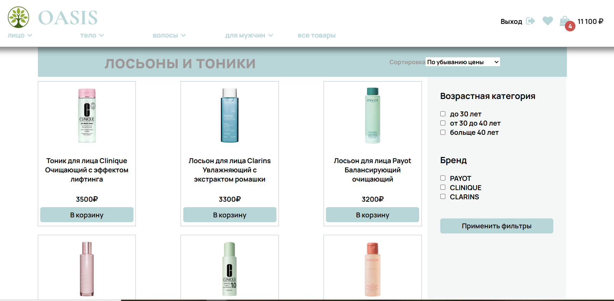
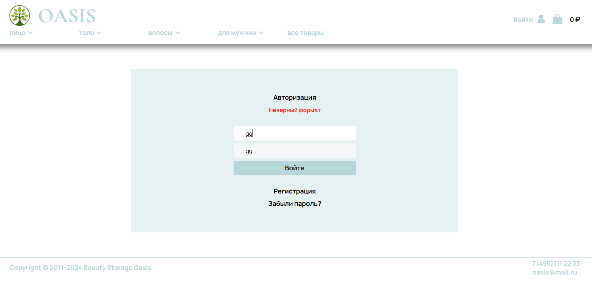
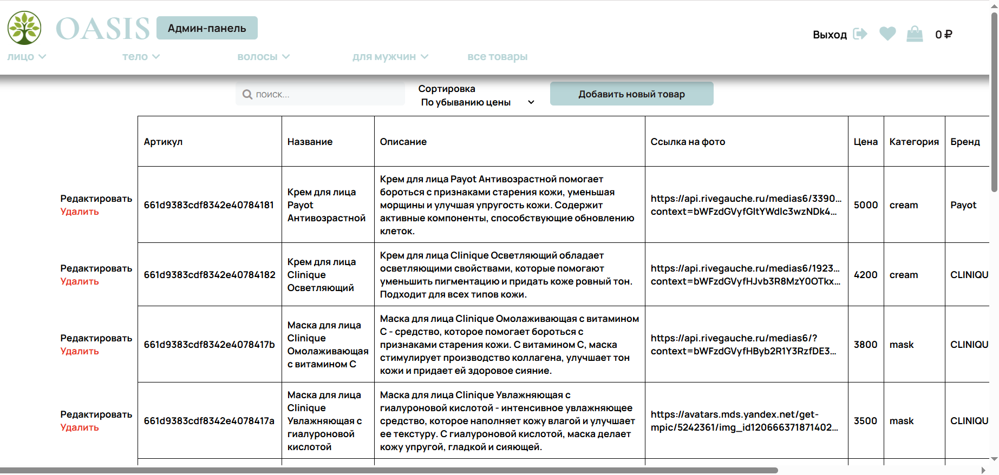
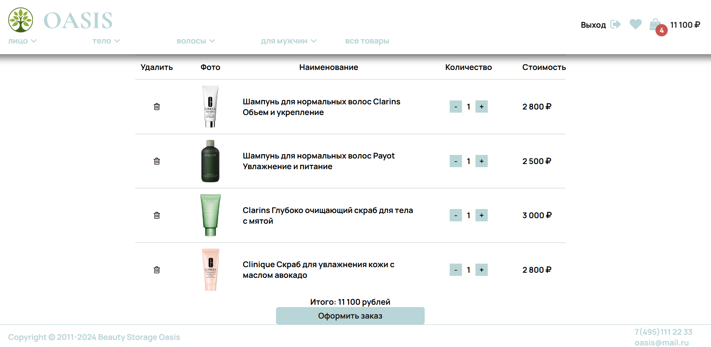

# Oasis Cosmetics (выпускной проект курса "Junior frontend")

## Описание проекта

Интернет-магазин косметики с полным циклом взаимодействия. Реализованы клиентская часть и админ-панель.

## Функционал
### Для пользователей
- Регистрация и авторизация
- Восстановление пароля через email
- Фильтрация и сортировка товаров
- Добавление товаров в корзину


### Для администраторов
- Добавление/удаление товаров
- Редактирование каталога


## Стек технологий

### Backend
- Node.js + Express
- MongoDB (Mongoose для моделей)
- JWT-аутентификация
- REST API
- Валидация данных (validator.js)
- Bcrypt для хеширования паролей
- Nodemailer для почтовых уведомлений
- Docker для развертывания

### Frontend
- React.js (SPA)
- Redux (управление состоянием)
- React Router (навигация)
- React Hook Form + Yup (валидация форм)


## Установка и запуск

Создайте файл `.env` в папке `backend` со следующим содержимым:

```env
MONGODB_CONNECTION_STRING=your_mongodb_connection
JWT_SECRET=your_strong_jwt_secret
```

### Запуск через Docker

```bash
docker build -t oasis .
docker run -p 3006:3003 -d oasis   
```

### Ручная установка

#### Backend

```bash
cd backend
npm install
npm run serve
```

#### Frontend

```bash
cd frontend
npm install
npm run dev
```

## Скриншоты интерфейса










